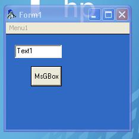



## Transparent Caption

### Description

how to set NonClient area transparent..

if u find a bug pls let me know...

i made it for skinning

most of the lines are commented.

Paul Caton s subclasser is used ;)

HF...
 
### More Info
 

             |
---                |---
**Submitted On**   |2007-01-26 08:40:02
**By**             |[Basak Karpuz](https://github.com/Planet-Source-Code/PSCIndex/blob/master/ByAuthor/basak-karpuz.md)
**Level**          |Advanced
**User Rating**    |5.0 (40 globes from 8 users)
**Compatibility**  |VB 6\.0
**Category**       |[Graphics](https://github.com/Planet-Source-Code/PSCIndex/blob/master/ByCategory/graphics__1-46.md)
**World**          |[Visual Basic](https://github.com/Planet-Source-Code/PSCIndex/blob/master/ByWorld/visual-basic.md)
**Archive File**   |[Transparen2044891262007\.zip](https://github.com/Planet-Source-Code/basak-karpuz-transparent-caption__1-67742/archive/master.zip)

